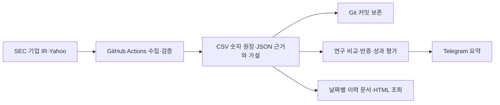

# 투자리서치 구조 점검 — 2026-09-25

## 결론과 이번 변경

시계열 저장은 작동하고 있다. 문제는 텔레그램에서 누적 이력을 볼 수 없다는 점, 분기·병목 지표의 수집 범위가 좁다는 점, 실행과 저장이 GitHub Actions/Git에 결합되어 있다는 점이다. 도메인 구매나 DB 변경만으로 연구 데이터의 깊이가 개선되지는 않는다.

현재 1인·3기업 일간 연구에서는 CSV/JSON 원장과 Git 이력을 유지한다. 이번에 날짜별 조회, 관측 범위 보고서, 독립적인 분기 컨센서스 수집, 실행 이벤트 보존을 추가했다. 상시 운영의 목표 구조는 **Python 연구 서비스 + PostgreSQL + 원문 파일 저장소 + 웹 조회 + Telegram 알림**이다. GitHub는 코드·검증·배포를 맡긴다. 웹 주소는 마지막에 붙이는 접근 경로다.

## 실제 저장 감사

변경 전 기준 커밋 `904bfc7`, 점검 시각 한국시간 9월 25일 0시경. 그때의 최신 완료 운영 실행은 [9월 24일 전체 실행](https://github.com/onepuhch/research/actions/runs/36015671992)이다. 자정 직후 확인이므로 9월 25일 일간 실행이 없다는 사실 자체는 누락이 아니다.

|항목|변경 전 실측|해석|
|---|---|---|
|live 숫자 관측|164건 / 같은 정의 33개|덮어쓴 최신 값만 있는 구조가 아님|
|연간 EPS|CRDO 2기간 × 17일, ALAB·MRVL 각각 2기간 × 16일|9월 7일 또는 9월 9일부터 실제 누적|
|가격|기업별 14건 / 11관측일|9월 14~24일. 거래일 수·종가 수가 아님|
|분기 EPS·매출|기업별 2지표 × 1일|9월 24일 수동 확인. 이때는 자동 수집 없음|
|판단 변경|15건|review_history에 이전/이후 보존|
|원래 가설 스냅샷|3개|당시 판단과 미래 평가 조건을 별도 보존|
|조정 주가 원자료|조회 묶음 2개|원래 연구 관측일과 역사 시세를 조회한 날은 다름|
|연구 신호|892건|문서·신호 수는 독립 근거 수가 아님|
|업종 지표 정의 / 섹터 원장|각 0건|value_chain.json·사례 JSON에 정의 일부가 있지만 지표 원장이 통합되지 않음|
|data 폴더|약 4.0MB|현재 병목은 저장 용량이 아님|

CRDO 연간 EPS 관측에는 9월 8일이 비어 있다. 당시 값을 오늘 만들어 채우지 않는다. ALAB EPS는 값이 같은 날도 행이 쌓여 있다. 30/90/180일 평가가 대기인 것은 원장 미저장이 아니라 평가 기간 미도래다. 첫 30일 기준일은 10월 14일이다.

전체 숫자와 날짜는 매 운영 실행 후 갱신되는 [데이터 누적 현황](data_history.md)에서 확인한다. 이 문서의 표는 변경 전 감사 기록이다.

## 현재 흐름과 한계

- **저장:** metric_log는 관측을 추가한다. 같은 정의·같은 시각 중복은 방지한다. 동일 값의 다음 날짜 관측은 보존한다. 연간 EPS는 날짜 단위, 분기 EPS와 가격은 시각 단위이므로 건수와 관측일 수를 분리한다.
- **실행:** 일간 수집과 약 6시간 주기의 명령 확인이 같은 writer 슬롯을 쓴다. 충돌 방지에는 유리하지만 즉시 응답에는 부적합하다. GitHub는 예약 지연 및 일부 실행 누락 가능성을 명시한다. [공식 문서](https://docs.github.com/en/actions/reference/workflows-and-actions/events-that-trigger-workflows)
- **명령:** Telegram은 봇이 아직 수신하지 않은 업데이트를 최대 24시간 보관한다. 장시간 예약 장애가 나면 수신 전 명령을 잃을 수 있다. 이미 받은 명령의 로컬 재시도 큐와는 다른 문제다. [Bot API](https://core.telegram.org/bots/api#getting-updates)
- **이력:** 최신 run_status만으로 장기 오류율을 계산할 수 없었다. 이번부터 run_history에 각 실제 체크를 추가 보존한다. GitHub 예약 자체가 시작되지 않은 사건은 이 이벤트에 기록되지 않으므로 독립 감시는 여전히 별도 과제다.
- **보고서:** Actions의 생성 보고서 artifact는 30일 보존이다. CSV/JSON Git 원장은 이 만료와 무관하다. 누적 현황 Markdown은 이번부터 Git에 보존하고, HTML은 artifact에 포함한다.
- **배포와 장애:** Git 저장 push 실패 시 로컬 runner의 새 관측이 운영 원장에 합쳐지지 않을 수 있다. Git은 별도 복구 백업 서비스가 아니다. 저장 실패 감지·복구와 독립 백업을 갖춘 DB 전환이 장기적으로 유리하다.
- **데이터 권한:** 현재 저장소는 공개다. 비공개 가설·유료 원문까지 운영하려면 저장·공개 보고서를 분리해야 한다. 비공개 DB를 추가해도 이미 공개된 Git 이력이 자동으로 비공개가 되지는 않는다.

## 이번에 구현한 것

1. `/data`: 숫자 관측 건수와 정의 수, 조회 방법을 Telegram에서 확인.
2. `/history CRDO`: 같은 정의별 최초/최근 값, 최근 5관측일, 기간·출처·기준·경과일 조회. `/history ALAB`, `/history MRVL`도 지원.
3. `python scripts/data_history.py --save`: 누적 Markdown과 종목·지표 선택, 실제 관측점, 원문 링크가 있는 독립 HTML 생성. HTML은 생성 당시 스냅샷이며 실시간 서버 화면이 아니다.
4. `collect_quarterly.py`: Yahoo의 식별된 non-GAAP 모듈에서 현재·다음 분기의 EPS와 매출을 일간 수집. 연간 EPS 수집과 실패를 분리. 매출에는 non-GAAP 기준을 붙이지 않음. 같은 기간·제공자끼리 비교.
5. `consensus_history`: 검증된 분기 응답의 실제 수신 시각과 provider 원래 quarter 객체 보존. 응답의 7일 전·30일 전 EPS 필드는 실제 과거 관측으로 가져오지 않음.
6. `run_history`: 성공 후에도 이전 실패 이벤트 보존. 최신 상태는 기존 run_status에서 계속 조회. 기록 도입 전 실행은 소급 생성하지 않음.
7. 정기 보고서에 데이터 누적 안내 추가, workflow의 저장 대상과 건강 점검에 연결.

## 데이터 도메인 설계

새 DB를 만들더라도 아래 경계와 키를 그대로 보존해야 한다. ticker는 별칭이고 entity_id가 기업 식별 기준이다.

|영역|핵심 객체·관계|시간과 변경 규칙|
|---|---|---|
|기업·밸류체인|entity, entity_alias, value_chain_node, entity_node_link|기업명·티커 변경과 가설을 분리|
|근거|source_document, document_version, evidence_span|발표일, 수집일, 내용 해시, 원출처 그룹|
|숫자|metric_definition, observation, observation_revision|대상 기간, 관측 시각, 실제 시장 시각을 별도 컬럼으로 유지|
|가설|thesis, thesis_revision, thesis_evidence, review_event|해석 수정은 기존 판단을 덮어쓰지 않음|
|반증·복기|decision_test, test_result, return_cohort, return_evaluation|등록 시각 이후 사건만 사전 예측 평가. 수익률 계산 버전·가격 조회 시점 보존|
|운영·전달|job_run, source_attempt, command, delivery_outbox, delivery_receipt|재시도 키와 전달 영수증. 전달 성공이 수신자 열람을 뜻하지 않음|

현재 metric_log 메모 안의 market_time은 향후 별도 컬럼으로 승격할 대상이다. metric_definition은 현재 schema의 series_key 조합을 우선 그대로 옮긴다. 원문 source identity와 URL은 구별하고, 수정치는 원래 관측을 삭제하지 않고 정정 관계를 추가한다.

## 무엇으로 운영할 것인가

|선택|적합한 상황|이번 판단|
|---|---|---|
|현재 GitHub + CSV/JSON|한 명, 일간 관측, 작은 데이터, 변경 감사|당장 유지하며 조회·수집 누락 보완|
|Google Sheets / Notion|수동 검토·공유 화면|보조 화면 후보. 원래 판단·재시도·숫자 이력의 주 저장소로 전면 대체하지 않음|
|SQLite|한 서버의 단일 writer, 로컬 분석 캐시|단일 서버에서는 가능. runner 간 DB 파일을 Git/OneDrive로 주고받는 운영은 선택하지 않음|
|PostgreSQL + Python 서비스|상시 웹 조회·명령, 여러 worker, 비공개 연구, DB 트랜잭션|장기 운영 목표. 관리형 DB와 원문 파일 저장소 조합 권고|
|전용 시계열 DB / 대규모 분산 처리|고빈도·대량 시장 tick 데이터|현재 일간 3기업에는 필요 없음|

SQLite는 한 DB 파일에 한 writer만 허용한다. 여러 네트워크 클라이언트와 동시 writer가 필요한 상황은 client/server DB를 권한다. [SQLite 공식 선택 기준](https://www.sqlite.org/whentouse.html). PostgreSQL 전환 시 별도 백업과 복구 검증이 필요하다. [PostgreSQL 백업 문서](https://www.postgresql.org/docs/current/backup.html)

전환은 다음 순서로 수행한다: (1) 기존 원장 고정·백업 → (2) 같은 ID와 실제 관측시각으로 DB 가져오기 → (3) 정의별 건수·최초/최근·합계·해시 대조 → (4) 기존/신규 보고서와 반증 결과 비교 → (5) writer 하나를 DB로 전환 → (6) 백업에서 복구 시험 → (7) Git의 운영 데이터 쓰기 종료. 지속적인 양방향 dual write는 피한다. 검증 중 새 환경이 Telegram을 중복 발송하지 않도록 한다.

전환을 앞당길 조건은 상시 응답 요구, 여러 기기·사람의 동시 수정, 반복되는 writer 충돌, 비공개 원문 확대, SQL로 장기간 가설·숫자·근거를 함께 조회해야 하는 경우다. 데이터 용량이 커질 때까지 기다릴 필요는 없지만 현재 사용자 계정·호스팅·DB가 정해진 것으로 간주해 임의로 유료 가입하지 않는다.

## 웹 주소와 화면

도메인은 저장소도 스케줄러도 아니다. DNS는 사용자가 접속할 주소를 서비스에 연결한다. 별도 도메인 없이도 기본 호스팅 주소로 시작할 수 있다. GitHub Pages는 정적 HTML/CSS/JS를 제공하며 기본 github.io 주소와 커스텀 도메인을 지원한다. DB/API와 명령 처리 서비스는 별도다. [GitHub Pages 공식 설명](https://docs.github.com/en/pages/getting-started-with-github-pages/what-is-github-pages)

현재 구현은 로컬 파일 및 Actions에서 내려받는 읽기 전용 HTML이다. 새 공개 사이트·DNS·DB 계정을 개설한 상태는 아니다. GitHub에서 읽을 수 있는 [관측 이력 문서](https://github.com/onepuhch/research/blob/main/docs/data_history.md)는 운영마다 갱신된다.

장기 웹 서비스는 하나의 호스트 아래 경로를 나누면 충분하다. `/research` 가설 목록, `/companies/CRDO` 기업별 숫자와 근거, `/series/{id}` 날짜별 이력, `/reviews` 판단 변경, `/operations` 수집 상태를 권고한다. API가 필요하면 같은 호스트의 `/api`를 우선 사용한다. 도메인·서브도메인을 여러 개로 늘릴 이유는 아직 없다. 공개 보고서는 별도 내보내기로 만들고, 내부 연구 화면은 인증을 거친다.

## 연구 내용에서 남은 핵심

자동화된 숫자는 EPS·매출 컨센서스·주가에 집중되어 있다. 정작 병목 판단의 입력인 출하량, 동일 제품 ASP, 납기, 생산능력·가동률, 고객별 매출, 수주 취소가 희박하다. 따라서 신호 수 증가를 연구의 깊이로 평가하지 않는다.

우선 데이터센터 연결 테마에서 지표마다 **정의·단위·공개 원문·업데이트 주기·자료 없음 상태·가설 연결**을 등록하고, 원문에서 확인 가능한 실제 값을 축적해야 한다. 공급 계약은 수요/공급의 단서이며 부족의 직접 증명은 아니다. 제품 샘플링은 양산 매출과 구별한다. 현재 독립 제품별 EPS 모델은 물량·ASP·원가·세금·희석주식수 입력이 부족해 여전히 산출하지 않는다.

월간 순상향 연속 2회나 30일 성과는 시간이 지나야 측정할 수 있다. 시스템 이전으로 관측 이력을 오래된 것처럼 만들지 않는다. 다음 수동 연구 점검 9월 28일, MRVL 투자자 행사 10월 6일, 첫 30일 복기 10월 14일은 기존 등록을 유지한다.

## 검증 범위

로컬 회귀 테스트 62개 통과. 정의 혼합 방지·날짜 공백 미보간·변동 없는 날 보존·분기 단위/회계기준·실패 후 성공 이력·Telegram 명령 큐를 확인했다. HTML 생성 및 안전한 JSON 삽입 검증은 통과했다. 이후 9월 25일 Chrome 데스크톱·모바일 화면에서 39개 시계열을 모두 선택하는 검증도 통과했다. 스크립트 오류·가로 넘침은 없었고, 점과 표 행 수는 관측일 수와 일치했다. 운영 실행 및 발송 결과는 별도 검증 JSON에 기록한다.
